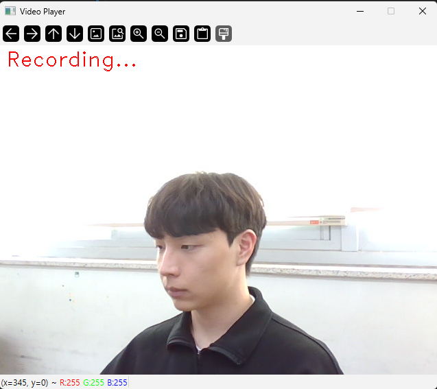
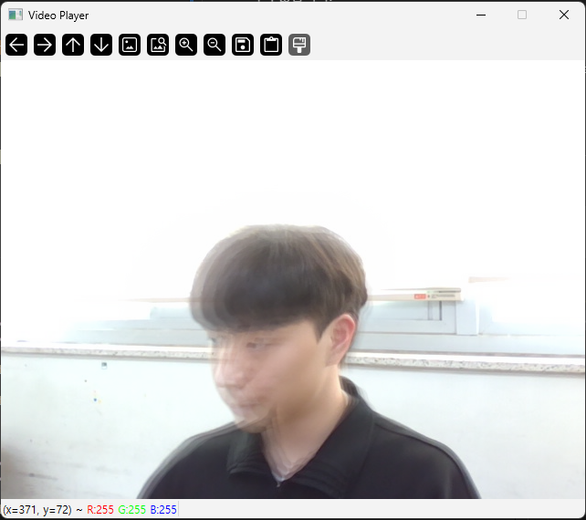

# TrailCam

TrailCam은 웹캠 영상을 실시간으로 나타내고 녹화할 수 있는 프로그램입니다.<br>
또한, 움직임에 따라 프레임 잔상(Motion Trail) 효과를 적용하여 동작의 궤적을 시각적으로 확인할 수 있는 기능도 제공합니다.

이 프로그램은 OpenCV를 이용하여 구현되었으며, 간단한 키보드 입력으로 녹화 및 효과를 제어할 수 있습니다.

## 주요 기능

* 웹캠 실시간 영상 출력
* 키 입력을 통한 영상 녹화
* 키 입력을 통한 Motion Trail(잔상) 시각 효과
* 영상 파일 저장


## 조작 방법

| 키    | 기능                       |
| ----- | -------------------------- |
| Space | 녹화 시작 / 녹화 종료      |
| T     | Motion Trail 효과 On / Off |
| ESC   | 프로그램 종료              |

### 1. 녹화 시작 / 녹화 종료 (Space)

Space 키를 누르면 녹화가 시작되며, 녹화 중에는 좌측 상단 위에 'Recording...'이 표시되며 녹화 중임을 나타냅니다.<br>
녹화 상태에서 Space 키를 누르면 녹화가 종료되며 파일로 저장됩니다. 저장 된 파일에는 'Recording...' 표시가 나타나지 않습니다.

### 2. Motion Trail 효과 (T)

T 키를 누르면 Motion Trail 효과가 나타납니다. 해당 효과를 활성화한 상태로 녹화 또한 가능합니다. <br>
Motion Trail 효과가 활성화 된 상태에서 T 키를 누르면 효과가 사라집니다.

### 3. 프로그램 종료 (ESC)
ESC 키를 누르면 프로그램이 종료되며 창이 사라집니다.

## 저장 파일

녹화된 영상은 아래의 형식으로 저장됩니다.

```
video_시간.avi
```
